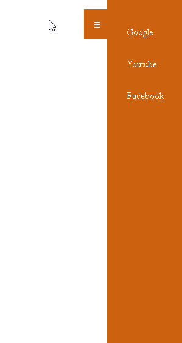

# Descrição: Diversos projetos em HTML, CSS e Javascript puro

## Projeto 1: Sistema de login com validação

 ;

## Descrição do projeto 1: sistema de login com validações de erros personalizados, responsivo e com tela de sucesso, caso o usuário preencha todos os campos de forma correta.

## Projeto 2: Slider

;

## Descrição do projeto 2: criando um slider com 3 imagens, utlizando javascript.

## Projeto 3: Menu toggle

;

## Descrição do projeto 3: menu toggle com transição ao clicar no botão.

## Projeto 4: Notificações

;

## Descrição do projeto 4: gera um alerta de notificações ao clicar no botão.

# Tecnologias utilizadas

1. HTML/CSS
2. Javascript

# Licença

📖 A licença é MIT.

