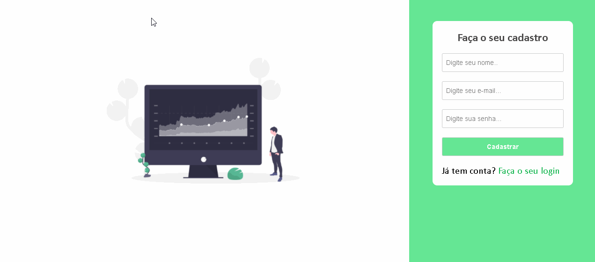

# Descrição: Diversos projetos em HTML, CSS e Javascript puro

## Projeto 1: Sistema de login com validação

 ;

## Descrição do projeto 1: sistema de login com validações de erros personalizados, responsivo e com tela de sucesso. Caso o usuário preencha todos os campos de forma correta.

# Tecnologias utilizadas

1. HTML/CSS
2. Javascript

# Licença

📖 A licença é MIT.

